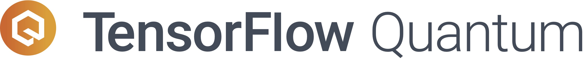

---

[TensorFlow Quantum](https://www.tensorflow.org/quantum) (TFQ) is a Python
framework for hybrid quantum-classical machine learning that is primarily
focused on modeling quantum data. TFQ is an application framework developed to
allow quantum algorithms researchers and machine learning applications
researchers to explore computing workflows that leverage Google’s quantum
computing offerings, all from within TensorFlow.

## Motivation

Quantum computing at Google has hit an exciting milestone with the achievement
of [Quantum Supremacy](https://www.nature.com/articles/s41586-019-1666-5).
In the wake of this demonstration, Google is now turning its attention to
developing and implementing new algorithms to run on its Quantum Computer
that have real world [applications](https://ai.googleblog.com/2019/10/quantum-supremacy-using-programmable.html).

To provide users with the tools they need to program and simulate a quantum
computer, Google is working on [Cirq](https://github.com/quantumlib/Cirq). Cirq
is designed for quantum computing researchers who are interested in running and
designing algorithms that leverage existing (imperfect) quantum computers.

TensorFlow Quantum provides users with the tools they need to interleave quantum
algorithms and logic designed in Cirq with the powerful and performant ML tools
from TensorFlow. With this connection we hope to unlock new and exciting paths
for Quantum Computing research that would not have otherwise been possible.

## Installation

See the [installation instructions](https://github.com/tensorflow/quantum/blob/master/docs/install.md).

## Examples

All of our examples can be found here in the form of
[Python notebook tutorials](https://github.com/tensorflow/quantum/tree/master/docs/tutorials)

## Report issues

Report bugs or feature requests using the
[TensorFlow Quantum issue tracker](https://github.com/tensorflow/quantum/issues).

In the meantime check out the [install instructions](./docs/install.md) to get
the experimental code running!

## Contributing

We are eager to collaborate with you! TensorFlow Quantum is still a very young code base,
if you have ideas for features that you would like added feel free to check out our
[Contributor Guidelines](https://github.com/tensorflow/quantum/blob/master/CONTRIBUTING.md)
to get started.

## References

If you use TensorFlow Quantum in your research, please cite:

TensorFlow Quantum: A Software Framework for Quantum Machine Learning
[arXiv:2003.02989, 2020](https://arxiv.org/abs/2003.02989).
